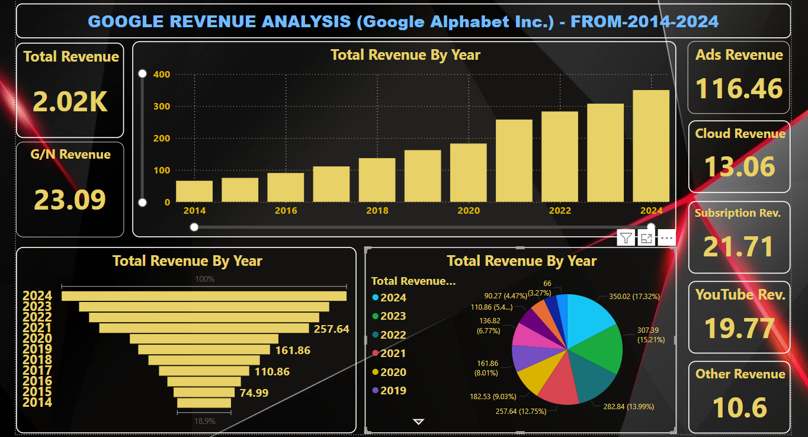

  

<h1 align="center">📊 Google Revenue Analysis (2014 - 2024)</h1>

  An insightful analysis of Google's revenue trends using Power BI. 
  This dashboard covers year-wise, segment-wise, and region-wise earnings from 2014 to 2024.

  
  
  

---

## 📌 Project Overview

The **Google Revenue Analysis** Power BI project aims to visualize and analyze Google's financial performance over the past decade. Using a clean and dynamic interface, the dashboard provides deep insights into business segments, global revenue sources, and patterns in growth.

---

## 🎯 Objectives

- 🗓️ Track Google’s revenue from **2014 to 2024**
- 🌐 Understand revenue by **region** and **business segment**
- 📉 Identify trends, dips, and peaks in income
- 📈 Forecast growth patterns using historical data

---

## 🛠️ Tools & Technologies

| Tool       | Description                           |
|------------|---------------------------------------|
| Power BI   | For creating interactive dashboards   |
| Excel      | Data collection & transformation      |
| DAX        | For calculations & KPIs               |
| Power Query| Data shaping and modeling             |

---

## 📈 Dashboard Highlights

- 📊 Year-wise Revenue Bar Charts
- 🌍 Geo Maps: Region-wise Distribution
- 🔍 Filters & Slicers (Year, Region, Segment)
- 📉 Trendline Analysis & Growth Rates
- 📥 Download Option for Reports

---

## 🗂️ File Structure

